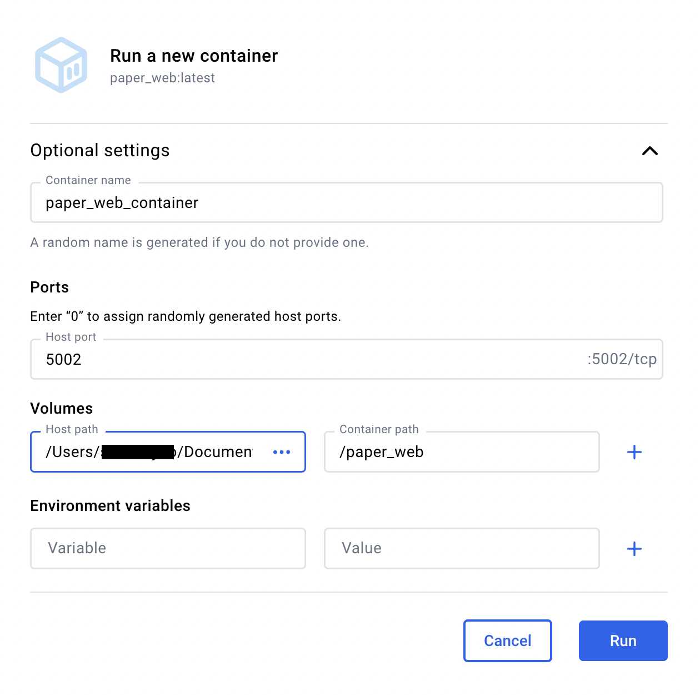
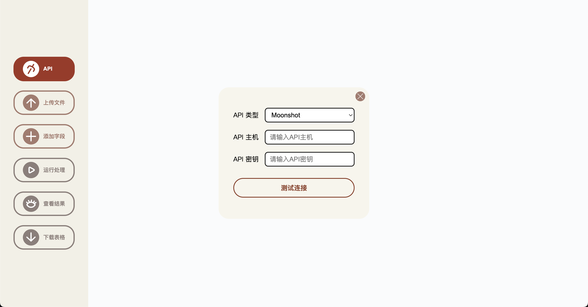
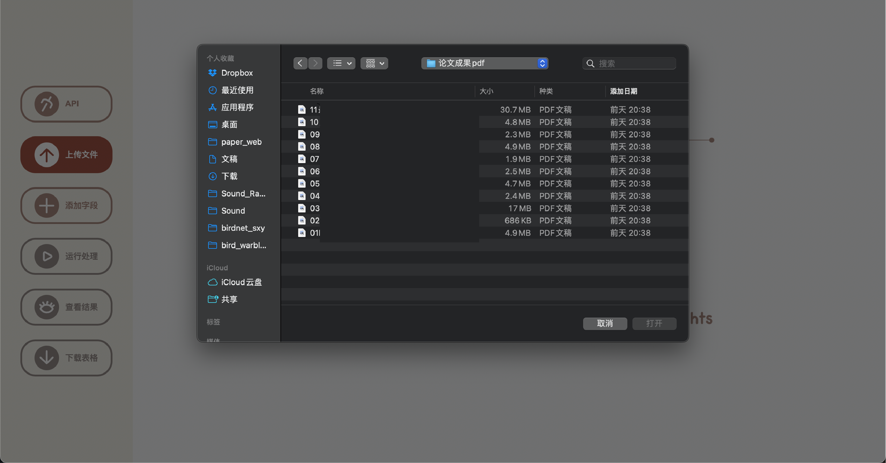
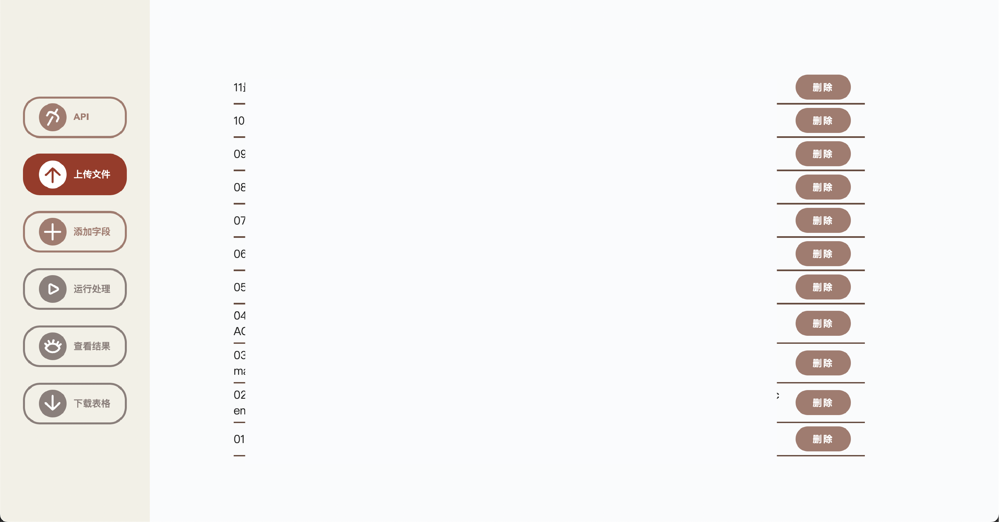
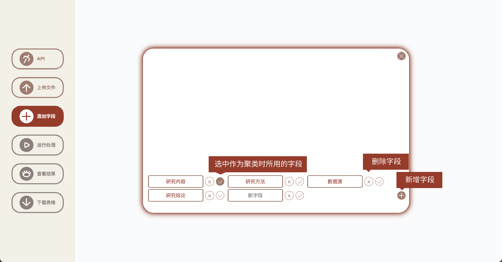
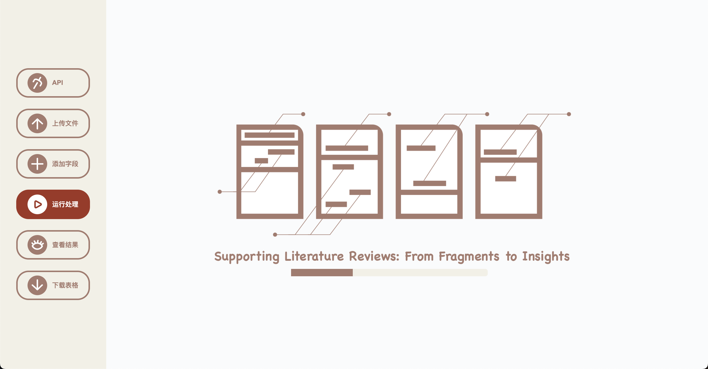
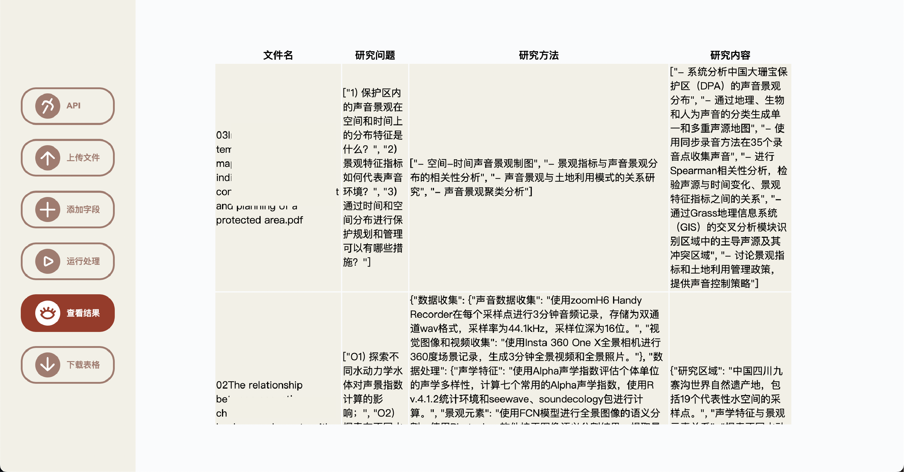

# paper-web 使用教程

### 简要介绍

<mark>**paper-web**</mark>是一款辅助文献综述的工具，可以帮助您实现【1】 利用大语言模型<mark>提取文献中的关键字段，进行比较分析</mark>，【2】 可以通过embedding对其中的关键字段向量化，然后使用kmeans聚类，<mark>总结同类文献的主题</mark>。

- PRD所在位置：[PRD](./paper-web%20PRD.markdown)

- 产品原型所在位置: https://www.figma.com/design/UUYsFPwTdoOaeaEfM15Lb3/paper_web?node-id=0-1&t=qJp2QApkHjxpfVau-1

### 推荐部署方式：

推荐使用<mark>Docker自部署使用</mark>，另外可在 http://180.76.147.10:5002/ 进行试用（试用网站速度较慢）。

（Docker自部署的好处在于：上传文件速度快，无敏感信息泄漏风险，无需下载大量的依赖包，即用即销）

1. 下载Docker, Git
2. 从Github拉取项目paper_web
3. 从终端导航至项目根目录，使用" docker build -t paper_web:latest . "构建镜像（Image）
4. 在Docker桌面端中打开构建好的镜像，点击运行新建容器（Container）：填入容器名称，外部端口，挂载卷即可
5. 打开新建的容器即可使用

### 使用教程

#### 1. 输入API

填入API类型、主机、密钥，点击“测试连接"。

- API类型目前仅支持Moonshot和OpenAI。**（目前仅OpenAI的AI类型支持根据字段聚类。）**
- API主机填入“https://api.moonshot.cn”或者“https://api.gptsapi.net”，使用的分别是/v1/files和/v1/chat/completion endpoint。

#### 2. 上传文件

上传需要被分析的文献PDF，上传完成后可以点击按钮删除。

#### 3. 添加字段

支持添加、删除字段。如果想要根据某些字段进行文献聚类，可以把需要考虑的字段勾选上。

#### 4. 运行处理

点击运行按钮开始，每个文献大概会花费5s左右的时间，等待进度条结束即可点击查看结果。

- 在以上必要信息全部填完以前，该按钮会被置灰，无法点击。
- 目前这样设置是因为考虑到调用大模型的速率限制，如有必要，可以在main.js和server.py里面修改。

#### 5. 查看结果

可以滑动查看生成的表格。

#### 6. 下载表格

点击下载表格到本地。

注：

|                     | 默认模型                                                     |
| ------------------- | ------------------------------------------------------------ |
| 提取字段            | Moonshot: moonshot-v1-32k OpenAI: gpt-3.5-turbo（考虑到token限制，目前只取了第一页的内容） |
| 聚类时Embedding模型 | OpenAI: text-embedding-3-small                               |
| 主题总结            | OpenAI: gpt-4.1                                              |

